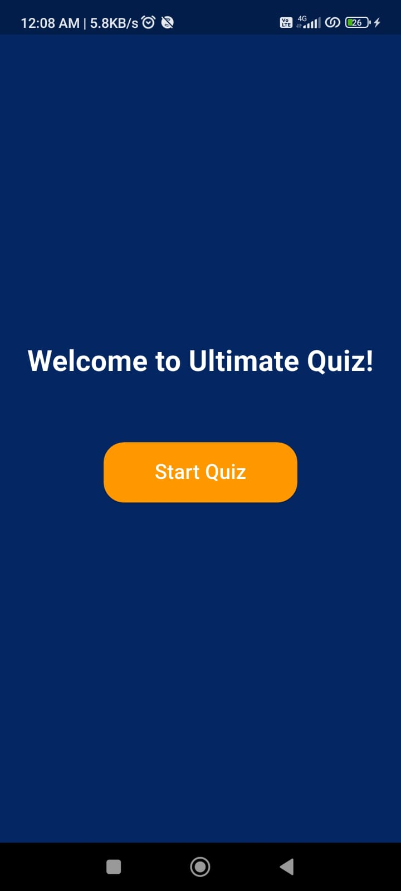
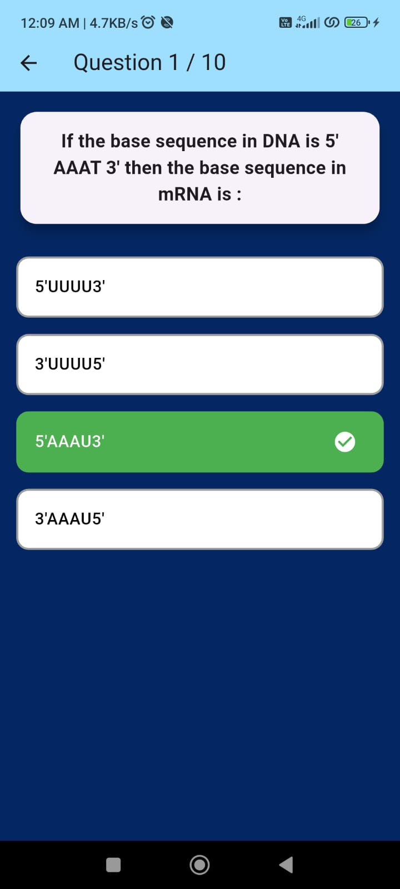
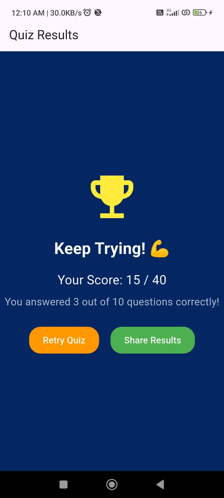

# Quiz App

A Flutter-based quiz application with gamification features that fetches quiz data from an API and provides an engaging user interface.

## Features

### 🎯 Start Quiz
- Responsive UI adapting to different screen sizes
- Interactive user interface

### ❓ Dynamic Questions  
- API-fetched multiple choice questions
- Instant feedback on answers

### 📊 Score Summary
- Total points tracking
- Correct/incorrect answer breakdown

### 🎮 Gamification
- Animated answer feedback
- Progress tracking indicators

## Technical Stack

- **Framework**: Flutter
- **Language**: Dart
- **API**: REST using Dio package
- **Architecture**: MVC pattern

## Project Structure
```
lib/
├── models/
│   └── quiz_model.dart
├── services/
│   └── api_service.dart
├── screens/
│   ├── home_screen.dart
│   ├── quiz_screen.dart
│   └── result_screen.dart
├── widgets/
│   └── responsive_question_container.dart
└── main.dart
```

## Getting Started

1. Clone repository:
```bash
git clone <repository_link>
```

2. Navigate to project:
```bash
cd quiz_app
```

3. Install dependencies:
```bash
flutter pub get
```

4. Run the app:
```bash
flutter run
```

## Screenshots

### Home Screen


### Quiz Screen


### Results Screen


## API Integration


**Response Format**:
```json
{
    "title": "Quiz Title",
    "description": "Description of the quiz",
    "questions": [
        {
            "description": "Question text",
            "options": [
                {
                    "description": "Option text",
                    "is_correct": true
                }
            ]
        }
    ]
}
```

## Roadmap
- Leaderboard implementation
- Achievement badges
- Social media sharing
- Enhanced animations

## Author
Contact: [Your Email]